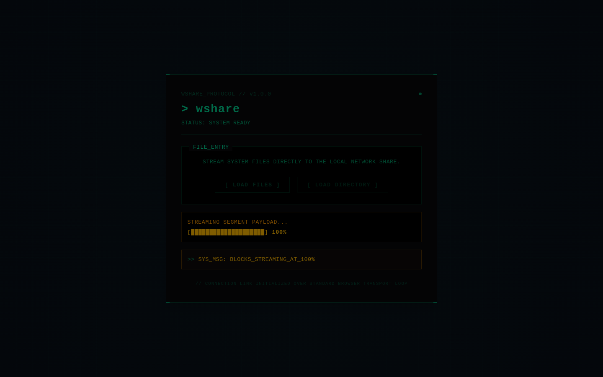
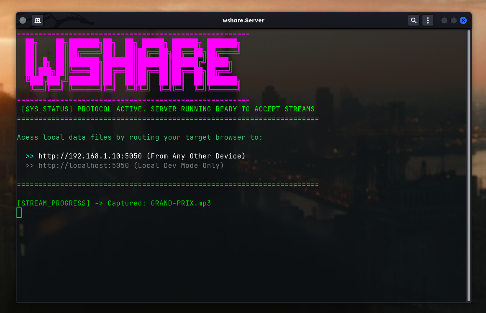

#  wshare

A lightweight local network file transfer tool built with **.NET** that enables browser-based file and folder transfers between devices on the same Wi-Fi network using a streaming HTTP server.

---

## 📡 Overview

`wshare` allows devices on the same local network to transfer files directly through a browser.

One device runs the server, and others connect using the displayed LAN address. Transfers are streamed over HTTP and written directly to disk in real time.

---

## Screenshots

<table>
  <tr>
    <td width="50%">
      
    </td>
    <td width="50%">
      
    </td>
  </tr>
</table>

---

## 📁 Project Structure

```text
wshare/
├── screenshots/
├── wshare.Server/
└── wshare-client/
```

---

## 🚀 Releases

Prebuilt standalone binaries are available in the Releases section.

### Linux

```bash
chmod +x wshare.Server
./wshare.Server
```

### Windows

```bash
wshare.Server.exe
```

---

## 💻 Local Development

### Build frontend

```bash
cd wshare-client
npm install
npm run build
```

### Run server

```bash
cd ../wshare.Server
dotnet run
```

The server prints LAN access URLs automatically.

Open one from another device on the same Wi-Fi network.

---

## ⚙️ How it works

- Starts a .NET HTTP server on port `5050`
- Detects and prints active LAN IPs
- Serves React UI from `wwwroot`
- Accepts streamed multipart uploads
- Writes files directly to disk (no full buffering)
- Preserves folder structure during upload

---

## 🧱 Stack

- .NET
- React

---

## 📄 License

[MIT](./LICENSE)
